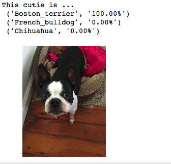

# Dog Breed Classifier

Build a pipeline that can be used within a web or mobile app to process real-world, user-supplied images. Given an image of a dog, the algorithm will identify an estimate of the canine’s breed. If supplied an image of a human, the code will identify the resembling dog breed.  

## Convolutional Neural Networks Workbooks

* `mnist_mlp.ipynb` - train an MLP to classify images from the MNIST database
* `cifar10_mlp.ipynb` - train an MLP to classify images from the CIFAR-10 database
* `cifar10_cnn.ipynb` - train a CNN to classify images from the CIFAR-10 database
* `cifar10_augmentation.ipynb` - train a CNN on augmented images from the CIFAR-10 database
* `conv_visualization.ipynb` - visualize four activation maps in a CNN layer
* `bottleneck_features.ipynb` - calculate VGG-16 bottleneck features on a toy dataset
* `transfer_learning.ipynb` - use transfer learning to train a CNN to classify dog breeds

