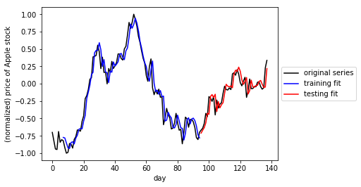

# Time Series Prediction and Text Generation

Build RNNs that can generate sequences based on input data - with a focus on two applications: With the first we'll use real market data in order to predict future Apple stock prices using an RNN model. The second one will be trained on Sir Arthur Conan Doyle's classic novel Sherlock Holmes and will generate wacky sentences based on it that may - or may not - become the next great Sherlock Holmes novel!

`RNN.ipynb`:
         
* Problem 1 - Perform time series prediction: using a RNN regressor to forecast the stock price of Apple 7 days in advance. The particular network architecture we will employ for our RNN is known as  [Long Term Short Memory (LTSM)](https://en.wikipedia.org/wiki/Long_short-term_memory), which helps significantly avoid technical problems with optimization of RNNs.  

  * 1.1 Load data
  * 1.2 Cutting our time series into sequences
  * 1.3 Splitting into training and testing sets
  * 1.4 Build and run an RNN regression model
  * 1.5 Checking model performance

  

* Problem 2 - Create a sequence generator: implementing a popular RNN architecture to create an English language sequence generator capable of producing semi-coherent English sentences from scratch by building them up character-by-character, using a complete version of Sir Arthur Conan Doyle's classic book The Adventures of Sherlock Holmes.

  * 2.1 Preprocessing text dataset
  * 2.2 Cutting data into input/output pairs
  * 2.3 One-hot encoding characters
  * 2.4 Setting up RNN
  * 2.5 Training RNN model for text generation

## Resources

* [On the difficulty of training recurrent neural networks](http://proceedings.mlr.press/v28/pascanu13.pdf)
* [Time Series Data Library](https://datamarket.com/data/list/?q=provider%3Atsdl)
